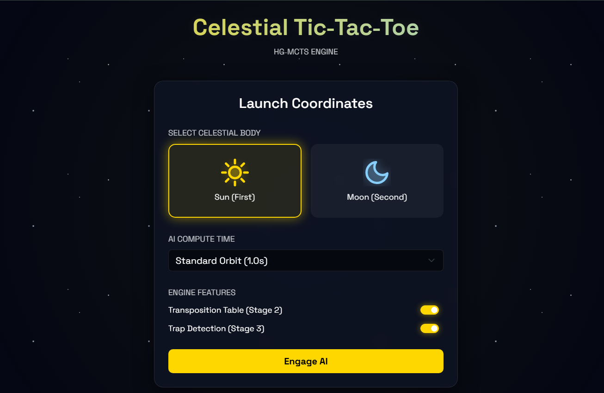
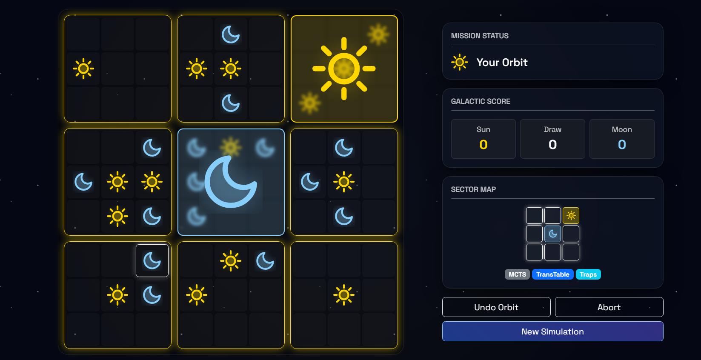

## ultimate-tic-tac-toe-using-heuristic-guided-monte-carlo-tree-search

A fully playable **Ultimate Tic-Tac-Toe** game featuring a space-themed web UI. 

At its core runs a custom, three-stage **Heuristic-Guided Monte Carlo Tree Search (HG-MCTS)** AI engine designed to navigate the massive state space of Ultimate Tic-Tac-Toe.

---
## What is Ultimate Tic-Tac-Toe?

Ultimate Tic-Tac-Toe is a meta-game played on a 9×9 grid divided into nine 3×3 small "macro" boards.
- Each move you make sends your opponent to a specific small board. (e.g., Playing in the top-right cell of a small board forces your opponent to play their next move in the top-right macro board).
- Win three small boards in a row on the global 3×3 macro grid to win the game.
- If a player is forced into a small board that is already won or full, they earn a "Free Choice" and may play anywhere on the board.

## The AI Engine: 3-Stage HG-MCTS

Standard MCTS struggles with Ultimate Tic-Tac-Toe because early random rollouts rarely hit meaningful terminal states. This engine solves that using a heavily optimized three-stage architecture:

| Stage | Name | Description |
| :--- | :--- | :--- |
| **Stage 1** | **HG-MCTS Base** | Replaces random rollout playouts with heuristic-guided rollouts (picking top 3 moves via a greedy epsilon). Cuts off early at depth 35. |
| **Stage 2** | **Transposition Table** | Uses Zobrist Hashing to cache and reuse visits/wins across different move permutations and turns, holding up to 200k entries. |
| **Stage 3** | **Trap Detection** | Fork-aware macro scoring. Heavily rewards moves that create two simultaneous macro threats (a fork) or block an opponent's fork. |

### Deep Dive: Heuristic Scoring & Trap Detection
The AI evaluates non-terminal board states using a weighted point system. Stage 1 handles tactical and positional advantages, while Stage 3 specifically looks for game-ending macro forks.

**`Score(move)` Weight Breakdown:**
* `+100` : Immediate small-board win
* `+80`  : **[Stage 3]** Create a macro-board fork (2 winning threats)
* `+60`  : Block opponent's small-board win
* `+50`  : **[Stage 3]** Block an opponent's macro-board fork
* `+40`  : **[Stage 3]** Create a triple threat (≥3 lines threatened)
* `+25`  : Create a 2-in-a-row on the macro board
* `+18`  : Send opponent into a finished macro (forcing them to play freely is less ideal, but winning the board to enforce the constraint is rewarded)
* `+15`  : Create a 2-in-a-row inside a small board
* `+12`  : Play in the center cell of a small board
* `+8`   : Win the center macro board
* `+6`   : Play in a corner cell of a small board
* `+3`   : Win a corner macro board

### Installation
1. Clone the repository:
   https://github.com/LucifersBossyCat/ultimate-tic-tac-toe-using-heuristic-guided-monte-carlo-tree-search.git
